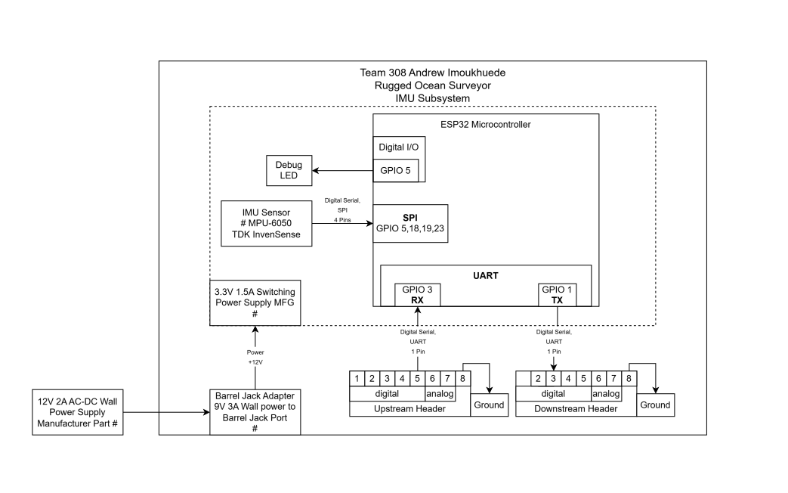

## Overview
For this Inertial Measurement UNIT module there is a 3.3V power supply for the micro-controller and all components. This module is connected to the controller and HMI module via UART and delivers measurements downstream on the orientation and speed of the device.

## IMU Block Diagram 

## Download
The Diagram is also available as a [*pdf*](Block.pdf) and a [*Draw.io file*](https://viewer.diagrams.net/?tags=%7B%7D&lightbox=1&highlight=0000ff&edit=_blank&layers=1&nav=1&title=Copy%20of%20INDIVIDUAL&dark=auto#R%3Cmxfile%3E%3Cdiagram%20name%3D%22Page-1%22%20id%3D%22QpGGdMiPVVgRiFB68Lla%22%3E7Vxbc9o4FP41zLQPZHzHPAZI0nSbbSYk2%2FZRYMV4YyxWiAD99SvZMvgiiDESDpnyYluWZPk79%2BMjWmZ%2FurrBYDa5Qx4MW4bmrVrmoGUYpq659MBa1kmL3tG0pMXHgcfbtg3D4DfkjWm3ReDBea4jQSgkwSzfOEZRBMck1wYwRst8t2cU5p86Az4sNQzHICy3%2Fgg8MklaXVvbtn%2BBgT9Jn6yn7zcFaWfeMJ8ADy0zTeZVy%2BxjhEhyNl31YcjQS3FJxl3vuLtZGIYRqTLAeNB0rdP56n39EaEnd3qz%2Fv27LZiFN83JOsUAo0XkQTaN1jJ7y0lA4HAGxuzukpKdtk3INKRXOj19hZgEFL%2FLMPAj2kYQ6%2FAchGEfhQjTlghFdGgvecwrCBf8MS3DCQnri%2BhSsgtw%2Flug9EZ7HrPIJe2gW7NVPE96n5757PgIwZTeNxnzaZeRh%2BGSntxO0eJlsoAeTB9EsUqelQxLm73gtdh09JIeFr5PETS072MIInocLvArXFM89q%2BFNguWo2KFt3dP8bJG8%2FWcwOmB64pJSSkPVxkm4nx4A9EUErymXSYZUbG61oWdjFxuJatj8DY%2BkW1raS%2BuQowuFyjARdvfzL%2FlfnrCBUAsDBPr3%2Bto9XD7NPC%2FgeBuYP%2Fdu2nrHenSIOB7D8wn8XBdLAQ1oNxAkgHSTtv4NI7u5mA0bQkwCnWK0ZxOmaJXMIofwYZhSPk%2Be40IIJlraqxg9hp6QfYyROOXzQq5fcncLpHuanhvsqa7YIwR7U8wCkOI61HUFgmH0e3maOqaVp6mjiqaypcMwGk5phNSkPbYg1GqZob3txn9M6qgFTNNN%2Fe33%2Bn8FNQ%2Bk4S%2BTqHsG%2BZ%2BRStBzdll0XyDipariopuzlfivLz1UPZT16fkncnRV04ZE93JqytXM3OgUL%2Fxglr0zU9XBFG3DMU%2BKGVptBEiBE1FUvA0mxOcODRfIPBq6pN9iEvHUBfwU7MgeoFPVXtYTxULoEud%2FHW%2Bi3wkBf55s0iCCITIlwWklRf60%2BEq8FFU4FqCT5eFnDpozIagqen67oZmpRopqyGkTEVIWcqQshtCylKElDrT6TSElK0IKWW%2BrChYPwlSjiKkNsZPPlRuQ1B1VEGlTqefyP8vQeWqgkqZUk8fdA7RpK4ZzYSTojT9XjTVe%2FADtIzOLqRMWeMd4XiuMaVR1cE%2FHZQfI6g0qsYDxwJbwk96VJl%2Bv1UGVdWAQDpUZxdlGlUjAulQnV2YaVQNCaRDdXZxplE1JJAO1dkFmkbVkEA6VOcXaaYG4%2FRYnV%2BoaZ4qNChhdX6xpimQwSO%2FP5dQEXwzNi%2FMf2gn%2FcJmpTPDZUDGkyCijqp2j5YsbNKGi9ksZEjdXd8cULOz87OzpDisaEYKtR%2B2MmVpcapAr1RWt49yrPuQXyJMJshHNCS42rb28rTd9vmGWC1ITNF%2FISFrXkEIFgTl6Q1XAfnJhl%2FY%2FOpX5s5gxWeOL9b8Qgw%2BhiEgwWv%2B%2FURI8qH3KIhrs1JDZec%2F99vaptQjnWSOFngM%2BbgtRepMRQD2ISlNFRN38071S6aMQ%2Bgdv9Ue5rHLiu4UjBFRCDKcwS5%2FZe9teSO%2ByjKHoSX4vqm6juCio%2BTRFhjkEyjOHsA4rgT%2BCsYv9HDpgRmr8qmqIbtM7cb1ij9A%2FJIzrm8p8QytOPs9pfr5KN%2BOURJSeeQWpMlkk%2FsmHl4LLbOMll1wIXS3kKg1T5OotQXJm7NCrusoB05sAYx6FkBcgdusAciq%2F4w1OM4A2JqYvNINwD5ET6z%2FdYMpcIMp8Mt%2Be9DfKvKi41xRa9%2BBaPEMxmSB49H3gGl87eS63CxqJ4W6XJD3k1%2BMLq6sbrSMulT2%2B3T58Ciu%2B61BZHFddadQkWsV%2FGpleThBHly61UkKn02hL1SA%2BuHnvgJrCTImsGPFwt%2BCHbNdKSImtl12PdslDn2btV354GVrrY6yXUkKsqng5RQuWSIcehXheGxAOIrusWafTjpOAP8AjhYsnfbtalALMetNdeJ084BZuiq40sLZ95f6OlKGxbmnTpETNevCNfKzVM5jmeU8VnEu1Yks%2FgGhSjXTXvIXSPsNjGCYJ0dp51PRCZsGnpdQPuN5MdrP2NvHeNi9lj1gzhWbvgfGL37MJbK32Lo7NosO0toXbQhxwE76h2%2Bqnc%2FinbC1F5HfDpbMVnP37LFLsVhMEkTzA9dTUeMJJZUPaWsXuuV2cuJzsCw7ueGb0tp0AvT8PIdKpE5%2BjLOT5TPA863OMJrn9l9XyBtqd%2FdPbUdjVrnisMfBX3TYbfQKI%2FZAeCQrHJp7NAvWr6PK%2Bp1k6%2FQ7jFY3mtABU7aYaDSfVVEso43Obo%2BTl2T6hWAQzVMMe7E52twLGeXbHsAvn7A%2F%2BqTFOldLD5%2BTI7tj2HZykT35%2FFmouKgGvf6%2BU2vJYUrnjU3Lyvbzp8IgJTXZbcpzy4dpuz31pjKM8j%2FNlxykKv8est3frSYtUdykLaMuROxIuvW4dm%2BRyYfKSiRfuY6NaC4xButMB%2B5c73SSdL2TN6YOV1y7ohpqjN19A%2BhJsga5gcwhYehb7KM3ovVUs8%2Bx6rIW%2B3Ttw7in6zbBPI5M5nHeh8ncnXhvymQaR%2F0RR3NpBQ8%2Bg0VIROZXViTNvw%2Fy1Cve%2BqLJN8XjHNU0KuoUREtGOZyY0N0PS%2BgPkUIqfFpsNIekJzkkNSmk1KgU%2FlXH2fdhU2yXNv%2Fuoj47lHrlf6Tnj%2FS8B%2BnRNfd9iA%2B93P5vaNJ9%2B%2Fer5tX%2F%3C%2Fdiagram%3E%3C%2Fmxfile%3E)
