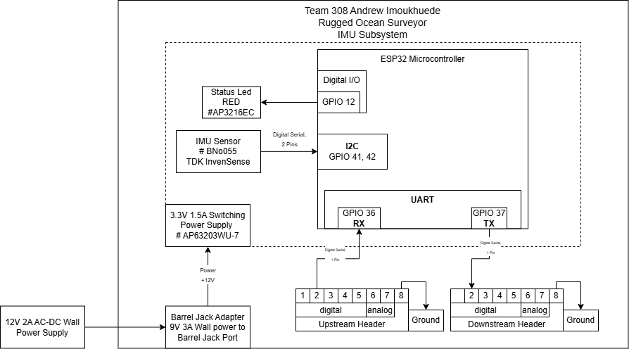

## Overview
For this Inertial Measurement UNIT module there is a 3.3V power supply for the micro-controller and all components. This module is connected to the controller and HMI module via UART and delivers measurements downstream on the orientation and speed of the device.

## IMU Block Diagram 

* I chose the BNO055 IMU because it combines multiple sensors and onboard processing, making it easier to get orientation data. The ESP32 was used for its processing power and built-in communication options. I2C was the only communication available on the breakout IMU. A regulated 3.3V supply ensures stable operation, and the LED helps with debugging. Overall, the design meets requirements by providing reliable motion tracking, communication, and power for underwater navigation.

## Download
The Diagram is also available as a [*pdf*](Block.pdf) and a [*Draw.io file*](https://viewer.diagrams.net/?tags=%7B%7D&lightbox=1&highlight=0000ff&edit=_blank&layers=1&nav=1&title=Copy%20of%20INDIVIDUAL&dark=auto#R%3Cmxfile%3E%3Cdiagram%20name%3D%22Page-1%22%20id%3D%22QpGGdMiPVVgRiFB68Lla%22%3E7VxZd5s4FP41Pqd9cA6I1Y9e0jSdpHXjZNI%2BYqNgGow8gGO7v34kEJhFJsSWTNwZvxgJSYjvXt1NV3SU4WJzFVjL%2BS2yodcBkr3pKKMOADLoafiP1GyTGkMykwoncG3aaFcxcX9DWinR2pVrw7DQMELIi9xlsXKGfB%2FOokKdFQRoXWz2hLziU5eWAysVk5nlVWsfXTuaJ7WmJu3qP0PXmadPliV6Z2GljWlFOLdstM5VKZcdZRggFCVXi80QegS8FJek36c9d7OJBdCPmnQAd5IsGcYX%2B8ujjx7MxdX29%2B8uYxRaFUbbFIMArXwbkmGkjjJYz90ITpbWjNxdY6rjunm08HBJxpcvMIhcjF%2Ffcx0f10WINHhyPW%2BIPBTgGh%2F5uOsgecyL5a3oYzpA9yLSFuGp5Ceg%2F7NC6Y1uGLNIHzeQ1eUmHie9j68c8n8PrQW%2BrxBWk%2Fq%2BHcA1vrheoNXzfAVtmD4IY5U8K%2BmWVtvuS7nq6CndrRwHIwikbzNo%2Bfh%2Fsgpe4BbjUT8XXM2YjogZXt8%2BxNOahtswgos3zismJaY83OSYiPLhFUQLGAVb3GSeWypqT72gwmG9W1kGoHV0IE2T0lZUgoAeXVAWXdpONv6O%2B%2FEFXQDsxTBXf33yN3fXDyPnxnJvR9rXwVVXNrivBgbf21Y4j7vL7EVwAJQZJDkgtbSODqPLZgFGReMAI1OmgPZkygK9WNP4EaRbADHf58sosqJcGesqmC9D280XPTR7zmZI9UvudoV0l5OxQqpu3VmAcPsoQJ4Hg8MoqrEWB%2Bj1CjQ1FbVIU10UTfmvDIvScoYHxCDV6INpJqLAMCd%2FpmWZNA1q5OTV%2BPobHl7Fsx6Sf8BRkmnV1fcKoVRTFKHMgjlE2XVnhNQT0MEUXPIRSXoVE1kvSiRTUgqgGJJ0gZV29pMFQdSrQlEHJS%2BhNUVRhBYsRn9YhlGQ2CyfoWUfKDLqEOeOoczgp3ZBtF0HS2%2FvMGnLgC6147fFJvyRZJjg7SJp%2BZaHHF5AqsVFfzpcGWaICFwr8Mm8kBMHjdISNAdat%2Fuh2YhGSm0JKUUQUqowpLSWkFIFISVOdeotIaUJQkqYLcvyx0%2BClC4IqUz58YfKbAkqQxRU4mT6iez%2FClSmKKiECfX0QefgTcoSaMedZEXia9EUb8GP0No%2FO5cyZY13hOO5%2BpSgqYF%2FOij%2FDKcSNPUHjgW2gh93r5IOogiDqqlDwB2qs%2FMyQVOPgDtUZ%2BdmgqYuAXeozs7PBE1dAu5QnZ2jCZq6BNyhOj9PM1UYp8fq%2FFxN5VSuQQWr8%2FM1FcYaPHKLuYIKY19YuVD%2Bxo3kC41kx0zWbjSbuz42VKUxWhO3SZqslksPv59uLcj4%2FjRcvi1BRyn37Y91BUjK4wPZVue2C81y1sq6ppQDogmTqColHbQr6XV15CXNJ7SIgmiOHIT9hstd7aDIALs2N4jkhMRk%2FwWjaEszCa1VhIpMATdu9IN0v9Bo6WfuzmhDR44LW1pggx9Az4rcl%2BL7sZCkXcfIjXO0Um2mFXMCNClL%2BUgHCdEqmEHab0eRQ4aKrMCBUWWomLjZOx2eOgXeQu%2F4rWqYR6tKw1Mwho8hyHEGKf7M39vxRlzKMweQEnxflW9HcNFR61FjaO0TSNeBFQRxQvAXa%2FaM%2F%2Fq2tSTZPk2FZ4%2FI5jhv8dGKX3JJhTImHpDKo48x1dsVqAaoLDx%2BJGTEx3iT8CrufhBaShUtrWQ7yGYpQqucJkKrMaI2Z4VcTxcOHFuqg8OkOju7tl2hnhfpOQl%2FnFDXJDZ5uQv1OkRPLNNlQIQyIEK5P%2ByOhjvhXLGYTyiJlbJsESiJGeE6%2Fmni7JznVhOcKwm5D%2F27e3ZG7gFEZmc8G6VEWrVk6QoLnzHC19x1RpKTrOg15zoyTO9%2B1OU%2Bc1hkDDVUTtgtqSHN5LLGPP%2B7J99Lz59UY%2Fo9Gi4fZsNJl6c%2FobaieQ70MxtonSTA2pYrcQpjii4Mo8nCuG9hYZQtW0kTsjKYWv8E%2BE%2BwGlmFuO6GnFmrkODuctTozEUS%2Boprw2V86q16PG2KXTcnnm13lihAYlhEgeWH6RvicaTcPY9QpmtbwfOHwJl%2BkJIDHenfx%2BSf3AGalhTyFx8%2Fdlin3%2FpjBcj6Zf58STLlJsfxeByGq6q%2B1KBJXU2juMetykAYi6UJwu8venek4GOHz4zy6pXUCxMUR2kcilOqobjyWKJjcXSjpEnWVi35S6S9sabQK5KjcoirbLUuXNtOKJ8zVQntl%2BTtYzy0QUcbEWuUDD%2FIxAHv08LmnnOvozTHR5rAwCUXeSHQ8HzwXvHWcBLk3cauH75R%2FDQUNMzlQbt0pQtZNY0Cz755AemF7lnebjoAenoKoRBW5%2B%2BJ7eWzHPD0qDT0w8L57Qb7QNLgK5KINmrY6X70F%2B507b9AnzwOctQ4TaKbSlEuqoYohXOSg9fv0KPOhA97c%2FG9W03XmNjf9sosPkypv3LkWdjXANLFwCX42WvLWCq6k%2FsdirZimPx3%2FSs2SZNvj1CPMz00yD90Uj4AziPnhG28mYexbW0Cy%2FvYid2F6Y8L2oMjGT7u2g8Ca5trQA3avTaSLBtFbapTybXPk8Da2KzrgC%2BSOfB1Ht7i%2Br3GPnIrYk80%2BxwrLw9in572Nu7pmW0wz1Ffn2jPx7Thk7XyIpZi4OXh0b2xatQs2U87zoTKQkQlmvNI72ISOlV4fyChm8YTNJHxhGMnISfxBDEf8cqC3r1iRFKvyw1lS6nsOyJcQwXMDSXAU6%2BxA2St7Chlm0jH7CidakOJSRnlf1nyX5clpm6WvvKn132eTqAwwcXdJzmT5rsPmyqX%2FwI%3D%3C%2Fdiagram%3E%3C%2Fmxfile%3E)
