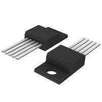
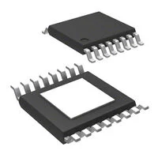
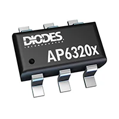
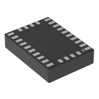
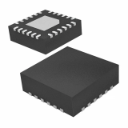
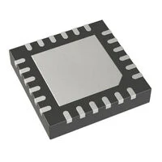
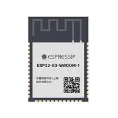
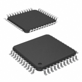

## Module's Selected Major Components

The following sections are the selected major components necessary for  .....

>**For each of the following sections, use <ins>one of the two styles</ins> given near the end. *REMOVE THIS NOTE***

### Power Management

**3.3 Volt Switching Regulator**

1. LM2575T-3.3

    

    * $2.51/each
    * [link to product](https://www.digikey.com/en/products/detail/onsemi/LM2575T-3-3G/1476700)

    | Pros                     | Cons                                    |
    |--------------------------|-----------------------------------------|
    | Inexpensive              | Lower efficiency vs modern regulators   |
    | Wide input voltage range | Physically large (older TO-220 package) |
    | Fixed 3.3V output        | Does not meet surface mount constraint  |

2. LM43603PWPT

    

    * $5.22/each
    * [link to product](https://www.digikey.com/en/products/detail/texas-instruments/LM43603PWPT/4832849?s=N4IgTCBcDaIDIFkAsBmAbABhQBQOrYBUQBdAXyA)

    | Pros                                          | Cons                                                         |
    |-----------------------------------------------|--------------------------------------------------------------|
    | Compact SMD footprint for space limited PCB's | Requires external passives to produce 3.3V                   |
    | Adjustable voltage output                     | None fixed-output creates risk of incorrect resistor sizing. |
    | Meets surface mount constraint of project     | Large output current (>2A) will lead to heating              |

3. AP63203WU-7

    

    * $0.71/each
    * [link to product](https://www.digikey.com/en/products/detail/diodes-incorporated/AP63203WU-7/9858426)

    | Pros                              | Cons                                            |
    |-----------------------------------|-------------------------------------------------|
    | Extremely Cheap                   | Harder to mount on board than larger models     |
    | Fixed 3.3V with small form factor | Long Manufacturer Lead Time                     |
    | Large maximum input voltage (40V) | Lower operating temperature than similar models |

Selected Model: AP63203WU-7 
Rationale: The AP63203WU-7 is a inexpensive option that meets the SMD requirements and provides a fixed 3.3V output on a large range on voltage inputs.

### Sensor

**Inertia Measurement Unit**

1. Bosch Sensortec BNO055

    

    * $12.34/each
    * [link to product](https://www.digikey.com/en/products/detail/bosch-sensortec/BNO055/6136301)

    | Pros                         | Cons                                      |
    |------------------------------|-------------------------------------------|
    | Onboard Sensor Fusion        | Not recommended for new designs (NRND)    |
    | Includes 3-axis magnetometer | More expensive than similar counterparts. |
    | Meets surface mount constraint of project | Higher current draw vs 6-axis models

2. TDK InvenSense ICM-20948

    

    * $6.78/each
    * [link to product](https://www.digikey.com/en/products/detail/tdk-invensense/ICM-20948/6623535)

    | Pros                                  | Cons                                                                   |
    |---------------------------------------|------------------------------------------------------------------------|
    | Inexpensive compaared to other 9-axis | Slightly more setup/computation than BNO05 to get sensor fusion output |
    | I²C interface and simple register map | Datasheet / supply status sometimes NRND                               |
    | Meets surface mount constraint of project | More expensive than 6-axis model

3. TDK InvenSense MPU-6050

    

    * $4.8/each
    * [link to product](https://www.digikey.com/en/products/detail/tdk-invensense/MPU-6050/4038009)

    | Pros                                                   | Cons                                                       |
    |--------------------------------------------------------|------------------------------------------------------------|
    | Extremely Cheap                                        | Aging/obsolete status. No more support                     |
    | Abundant community libraries for integration with chip | No built-in magnetometer. No absolute direction (north)    |
    | Meets surface mount constraint of project              | Lower performance / higher drift than modern 9-axis parts. |

Selected Model: TDK InvenSense ICM-20948 
Rationale: The ICM-20948 is a strong choice because it provides modern 9-axis sensing with power consumption while allowing full control over sensor fusion and I²C communication with the microcontroller . It is also half as expensive and significantly easier to implement that the the BNO055.

### MicroController

1. ESP32s

    

    * $4.99/each
    * [link to product](https://www.digikey.com/en/products/detail/espressif-systems/ESP32-S3-WROOM-1-N4/16162639)

    | Pros                     | Cons                                    |
    |--------------------------|-----------------------------------------|
    | Rich peripheral set              | Lower efficiency vs modern regulators   |
    | Large developer ecosystem and component library | Physically large (older TO-220 package) |
    | Integrated Wi-Fi + BLE        | Does not meet surface mount constraint  |

2. PIC18F47K42

    

    * $2.69/each
    * [link to product](https://www.digikey.com/en/products/detail/texas-instruments/LM43603PWPT/4832849?s=N4IgTCBcDaIDIFkAsBmAbABhQBQOrYBUQBdAXyA)

    | Pros                                      | Cons                           |
    |-------------------------------------------|--------------------------------|
    | Ultra-low power consumption               | No wireless connectivity       |
    | Small and cheap                           | Low memory and no DSP hardware |
    | Meets surface mount constraint of project | Smaller ecosystem than ESP32   |

3. PIC18F57Q43

    

    * $2.14/each
    * [link to product](https://www.digikey.com/en/products/detail/diodes-incorporated/AP63203WU-7/9858426)

    | Pros                                        | Cons                           |
    |---------------------------------------------|--------------------------------|
    | Better peripherals than other PIC18         | Still 8-bit performance limits |
    | Multiple Communication Interfaces           | No integrated Wi-Fi            |
    | Improved Analog Capability than other PIC's | Memory limits                  |

Selected Model: ESP32S 
Rationale: The ESP32S is built with IMU support that is vital for my sensor subsystem. It also a 32 bit microcontroller and will have greater processing power for calculating IMU sensor fusion than its 8 bit counterparts.
