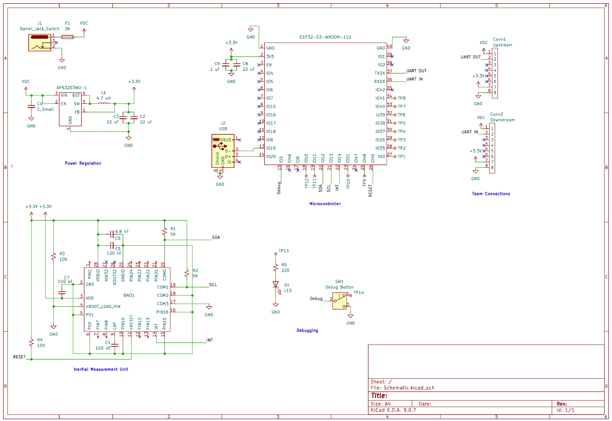

## Overview

This schematic is design to support the Inertial Measurement Unit of the teams Underwater Rover. It will provide measurements on the speed, location and direction of the rover.

{style width:"350" height:"300;"}
**Figure ##:** IMU Schematic.

## Resouces

The schematic as a PDF download is available [*here*](Kicad.pdf), and the Zip folder of the project [*here*](Project.zip).