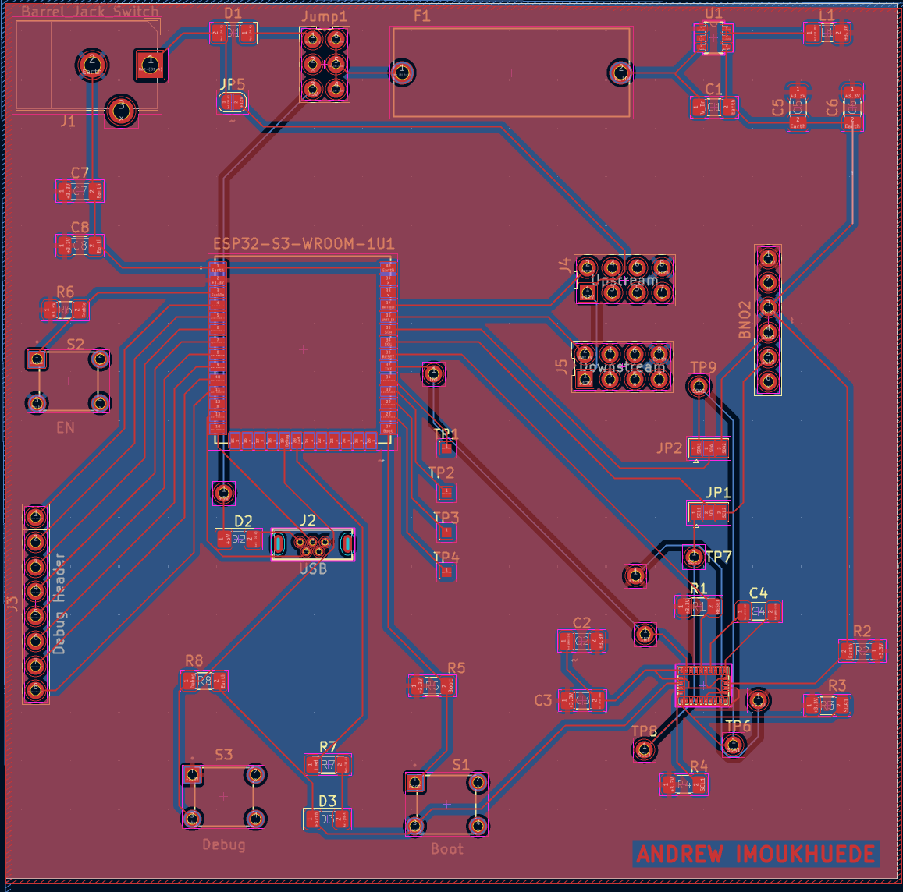

## PCB
This pcb is designed to provide the rover with all the functions of the IMU subsystem.

{style width:"350" height:"300;"}
**Figure ##:** IMU PCB.

## Final 
PCB out of hand till tuesday

## Resources

The PCB as a PDF download is available [*here*](PCB.pdf), the Zip folder of the project [*here*](Schematic.zip), and the [*Gerber Files*](Gerber.zip).