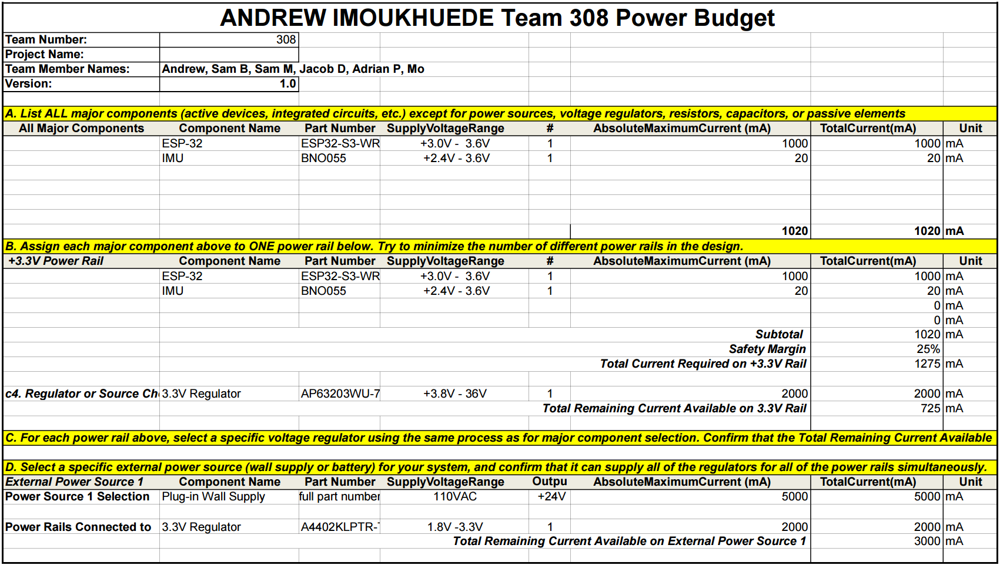

## Overview
I took the main components of the Inertial Measurement Unit Subsystem and found the maximum current of the electrical components in the system. I then performed calculations to see if the power supply would be able to handle the components. A safety margin was included to account for any high current consumption, and a budget was put together. 

>The current power budget satisfies the requirements of the subsystem.

{style width:"350" height:"300;"}

<!-- {style width:"350" height:"300;"}

{style width:"350" height:"300;"} -->

## Conclusions

From the prepare Power Budget, .....

## Resouces

The power budget as a PDF download is available [*here*](AndrewPowerBudget.pdf), and a Microsoft Excel Sheet [*here*](AndrewPowerBudget.xlsx).